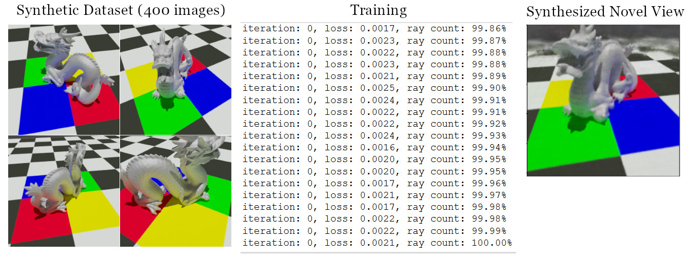

# minimal-nerf

This program is a minimal PyTorch implementation of NeRF. Note that the purpose of this program is not to exactly reproduce the original paper and it is missing  many of the advanced 
features. This program serves as a practical demonstration of how to create and train a neural radiance field using PyTorch

</img>

https://arxiv.org/abs/2003.08934
